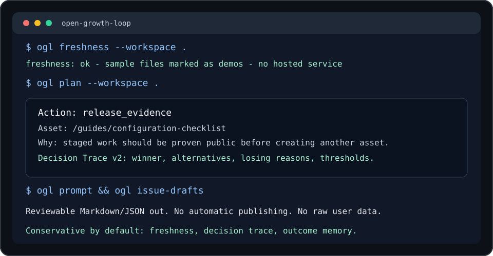

# Open Growth Loop

[](https://github.com/R3ijar/open-growth-loop/actions/workflows/ci.yml)
[](LICENSE)
[](pyproject.toml)

Local-first CLI for open-source maintainers who want **one evidence-based docs, content, or onboarding action per day** without sending project data to a hosted service.

Open Growth Loop turns Search Console exports, aggregate event CSVs, content inventory, and experiment logs into a conservative maintainer workflow:

```text
local CSVs -> freshness check -> ranked candidates -> one daily plan -> issue/prompt -> outcome memory
```



The tool is intentionally generic. It does not know about any one product, private app, customer database, or specialized domain. It is useful for projects that maintain docs, examples, changelogs, educational pages, package pages, or project websites and want to decide what to improve next from public/search signals and privacy-safe event aggregates.

## What You Get

After one local run, a maintainer gets:

- a freshness report that says whether the local evidence is recent enough to trust
- a ranked candidate list across release evidence, funnel issues, search opportunities, and planned docs work
- one conservative daily plan with Decision Trace v2 explaining why it won
- a Codex-ready prompt and a reviewable GitHub issue draft
- local action memory so completed work and later outcomes shape future ranking

## v0.1.2 Highlights

- **Data Freshness v1:** warns when real local CSV inputs are stale, empty, missing, future-dated, or only sample data.
- **Decision Trace v2:** explains the selected winner, ranked alternatives, losing reasons, thresholds, blocked state, and memory notes.
- **Local Issue Drafts:** turns the latest plan into reviewable Markdown without creating GitHub issues automatically.

## Why Maintainers Use It

| Maintainer problem | What Open Growth Loop does |
| --- | --- |
| Search queries, website events, and content ideas live in different places. | Reads simple local CSVs and builds one ranked candidate list. |
| Old exports can make recommendations misleading. | Reports data freshness before and inside the generated plan. |
| It is easy to start new docs before shipping staged work. | Prioritizes public release evidence before speculative new pages. |
| Small samples can make every experiment look important. | Marks weak evidence as insufficient instead of claiming success. |
| Assistants need focused tasks, not vague growth goals. | Writes one Codex-ready prompt from the selected daily plan. |
| It is hard to trust a black-box recommendation. | Explains why the selected action won and why alternatives lost. |
| Past work gets forgotten. | Records completed actions and outcomes so future ranking learns locally. |

## 60-Second Quickstart

From a local checkout on Windows PowerShell:

```powershell
python -m venv .venv
.\.venv\Scripts\Activate.ps1
python -m pip install -e .
python -m open_growth_loop --workspace . validate
python -m open_growth_loop --workspace . freshness
python -m open_growth_loop --workspace . candidates
python -m open_growth_loop --workspace . plan
python -m open_growth_loop --workspace . prompt
python -m open_growth_loop --workspace . issue-drafts
```

On macOS/Linux, activate the environment with `. .venv/bin/activate` before running the install and CLI commands.

Example plan output:

```json
{
  "action_type": "release_evidence",
  "asset": "/guides/configuration-checklist",
  "confidence": "high",
  "reason": "Staged work should be proven public before creating another asset."
}
```

## How The Loop Works


## Runnable Examples

The repository includes synthetic workspaces that show the planner on concrete OSS maintainer surfaces:

| Example | What it shows | Expected daily plan |
| --- | --- | --- |
| `examples/staged-release-check` | Staged docs work needs public release evidence. | `release_evidence` for `/docs/configuration-checklist` |
| `examples/funnel-dropoff` | A docs page gets views but weak downstream movement. | `fix_funnel` for `/docs/getting-started` |
| `examples/aliased-search-export` | Search exports with nonstandard headers can be mapped locally. | `search_striking_distance` for `/guides/plugin-migration` |
| `examples/package-page-cta` | A package page gets attention but not enough install/try clicks. | `fix_funnel` for `/packages/example-cli` |
| `examples/release-notes-search` | Release notes have near-ranking search demand. | `search_striking_distance` for `/changelog/v0.1.2` |

Run one from the repository root:

```bash
python -m open_growth_loop --workspace examples/package-page-cta validate
python -m open_growth_loop --workspace examples/package-page-cta freshness
python -m open_growth_loop --workspace examples/package-page-cta plan
python -m open_growth_loop --workspace examples/package-page-cta prompt
```

## Commands

- `ogl init` creates the local `data/` files for a project.
- `ogl validate` checks that CSV inputs are complete and privacy-safe.
- `ogl freshness` reports whether real local CSV inputs are recent enough to trust.
- `ogl candidates` writes all ranked action candidates considered by the planner.
- `ogl query-backlog` ranks Search Console rows into maintenance opportunities.
- `ogl plan` chooses one daily action using conservative rules.
- `ogl complete` records that a recommended action was actually done.
- `ogl outcome` records what happened later so future ranking can learn locally.
- `ogl track-experiment` records the action baseline.
- `ogl ship` records the public artifact once the change is live.
- `ogl review-experiments` avoids premature winner/loser claims from tiny samples.
- `ogl weekly-review` summarizes operating state across inventory and experiments.
- `ogl privacy-scan` checks local files for private-data leakage risks.
- `ogl prompt` writes a Codex-ready prompt for the next focused change.
- `ogl issue-drafts` writes a reviewable local Markdown issue draft from the latest plan.

## Inputs And Outputs

Open Growth Loop reads:

- Search Console rows: queries, pages, impressions, clicks, CTR, and position.
- First-party aggregate events: date, asset, event, and count.
- Content inventory: planned, staged, and published docs, guides, examples, and landing pages.
- Experiment ledger: what was changed, when it shipped, and when it should be reviewed.
- Action memory: what was completed and what happened later.

It writes reviewable Markdown/JSON files under `outbox/`:

- a ranked query backlog
- a data freshness report
- one daily action plan
- a decision trace with the winner, alternatives, losing reasons, thresholds, and memory notes
- an experiment review
- local action memory for completed work and outcomes
- a focused prompt for Codex or another coding assistant
- a local GitHub issue draft that can be reviewed before posting

Each report keeps the familiar `latest-*` path for daily use and also writes a dated copy under `history/` so maintainers can compare decisions over time.

It does not publish changes, call hosted analytics APIs, or send your project data anywhere.

## What It Does Not Do

- It does not upload analytics, search data, or project files to a hosted service.
- It does not accept raw user, session, customer, email, IP, token, or secret fields.
- It does not publish docs, open PRs, or modify your site automatically.
- It does not claim a change worked from tiny samples or missing artifacts.
- It does not require GitHub auth, Search Console API access, or third-party credentials.

## Privacy Boundary

Open Growth Loop is designed around aggregate inputs. The event importer accepts only:

```text
date,asset,event,count
```

It rejects private-looking columns such as email, user, session, ip, payload, token, key, secret, sku, or file. This keeps the public tool reusable while project-specific private data stays in your own repo or analytics system.

## Install For Development

From a local checkout:

```bash
python -m venv .venv
.\.venv\Scripts\python -m pip install -e .
```

On macOS/Linux, use:

```bash
python -m venv .venv
. .venv/bin/activate
python -m pip install -e .
```

## Full Command Flow

Initialize data files in a project:

```bash
ogl init --workspace .
```

Validate the local workspace:

```bash
ogl validate --workspace .
```

Check whether real local inputs are fresh enough to trust:

```bash
ogl freshness --workspace .
```

Run the sample planner:

```bash
ogl plan --workspace .
```

Inspect all ranked action candidates:

```bash
ogl candidates --workspace .
```

Write a query backlog:

```bash
ogl query-backlog --workspace .
```

Import aggregate events:

```bash
ogl import-events --source data/events.example.csv --output outbox/events.imported.csv
```

Track the latest daily plan as an experiment:

```bash
ogl track-experiment --workspace .
```

Record that the action was completed:

```bash
ogl complete --workspace .
```

Record the public artifact after the change ships:

```bash
ogl ship --workspace . --asset /docs/setup --artifact https://example.org/docs/setup
```

Record the observed outcome later:

```bash
ogl outcome --workspace . --asset /docs/setup --outcome directionally_positive --confidence medium
```

Review experiments after enough data has accumulated:

```bash
ogl review-experiments --workspace .
```

Summarize the current operating state:

```bash
ogl weekly-review --workspace .
```

Scan before sharing a workspace or example:

```bash
ogl privacy-scan --workspace .
```

Generate a Codex-ready maintenance prompt from the latest plan:

```bash
ogl prompt --workspace .
```

Write a reviewable local GitHub issue draft from the latest plan:

```bash
ogl issue-drafts --workspace .
```

Run tests:

```bash
python -m unittest discover -s tests
```

## Data Files

The default files live under `data/`:

- `content_inventory.example.csv`
- `search_console_rows.example.csv`
- `events.example.csv`
- `experiments.example.csv`
- `action_memory.example.csv`

For real use, copy them without `.example`:

```bash
copy data\content_inventory.example.csv data\content_inventory.csv
copy data\search_console_rows.example.csv data\search_console_rows.csv
copy data\events.example.csv data\events.csv
copy data\experiments.example.csv data\experiments.csv
copy data\action_memory.example.csv data\action_memory.csv
```

If your aggregate exports use different column names, add local schema aliases in `open-growth-loop.toml`:

```toml
[schema_aliases.search_rows]
search_term = "query"
url = "page"
shown = "impressions"
rank = "position"

[schema_aliases.events]
day = "date"
path = "asset"
kind = "event"
total = "count"
```

Aliases only rename local CSV headers into the expected schema. They do not add credentials, call hosted APIs, or relax private-column validation.

You can also tune conservative defaults in the same file:

```toml
[thresholds]
minimum_impressions = 25
minimum_views = 25
weak_cta_rate = 0.05
review_days = 14
stale_planned_days = 14
stale_shipped_days = 21
freshness_warn_days = 21
```

Command-line flags such as `--minimum-impressions`, `--minimum-views`, and `--weak-cta-rate` override the config for a single run.

`weekly-review` uses `stale_planned_days` and `stale_shipped_days` to flag work that has waited too long without artifact evidence or review readiness. `freshness` and `plan` use `freshness_warn_days` to warn when real local inputs are older than the trusted evidence window.

## Daily Loop

Recommended maintainer workflow:

```bash
ogl import-events --source path\to\aggregate-events.csv --output data\events.csv
ogl freshness --workspace .
ogl query-backlog --workspace .
ogl plan --workspace .
ogl issue-drafts --workspace .
ogl track-experiment --workspace .
ogl complete --workspace .
ogl ship --workspace . --asset /docs/setup --artifact https://example.org/docs/setup
ogl outcome --workspace . --asset /docs/setup --outcome directionally_positive
```

Then give `outbox/prompts/latest-prompt.md` or the plan output to Codex and work on one concrete change before recording the public artifact with `ogl ship`.

For a full walkthrough using the bundled sample CSVs, see [docs/EXAMPLE_WORKFLOW.md](docs/EXAMPLE_WORKFLOW.md).
For runnable example workspaces covering release evidence, funnel dropoff, aliased exports, package pages, and release notes, see [examples/README.md](examples/README.md).
For the initial public backlog, see [docs/NEXT_ISSUES.md](docs/NEXT_ISSUES.md).
For release notes, see [CHANGELOG.md](CHANGELOG.md).

## Decision Rules

The planner prioritizes:

1. Staged work that needs public release evidence.
2. Completed actions that still need an outcome recorded.
3. Funnel dropoffs with enough aggregate views.
4. Search opportunities with impressions and near-ranking positions.
5. Planned content/docs assets from the inventory.
6. Waiting for more data.

These rules are deliberately conservative. The tool should reduce thrash, not create a content treadmill.

Action memory gently adjusts candidate scores. Completed actions without outcomes are cooled down until they are reviewed. Exact asset/action repeats are cooled after measurement, while action types with directionally positive outcomes get a small boost for similar future work. Repeated weak outcomes get a small cooldown. This is local ranking context, not a causal impact claim.

Generated plans include a Decision Trace v2 block. It records the selected winner, ranked alternatives, why each alternative lost, thresholds used, blocked follow-ups, and memory adjustments. The trace is meant to be auditable by maintainers before they hand work to Codex or open an issue.

Generated plans also include a Data Freshness block. Sample `.example.csv` files are marked as sample data, while real local CSVs are checked by latest date or file modification time. Stale data is a warning, not a failure, so maintainers can still decide whether the signal is usable.

## Project Status

Current release: v0.1.2.

This is an early open-source extraction of a local growth-operations loop. It is ready for small CSV-driven maintainer workflows and intended to grow through issues, examples, and contributor feedback.

## License

Apache-2.0.
