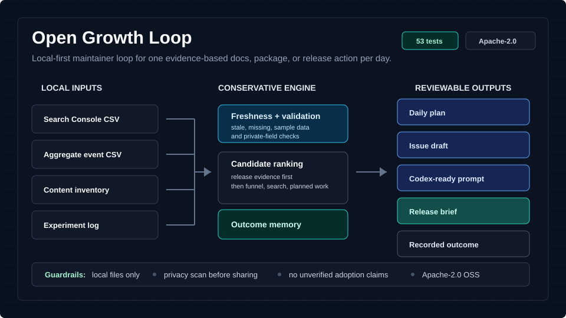

# Open Growth Loop

**Local-first maintainer intelligence for OSS repositories: audit any repo in one command, then turn real usage signals into one conservative daily action.**

[](https://github.com/R3ijar/open-growth-loop/actions/workflows/ci.yml)
[](LICENSE)
[](pyproject.toml)
[](https://github.com/R3ijar/open-growth-loop/releases/tag/v0.2.0)

There are two ways in:

1. **Zero-config repository audit.** Point `ogl audit` at any repository, or drop the [GitHub Action](#run-it-as-a-github-action) into a workflow. You get a scored maintainer-readiness report (README, license, onboarding, community files, CI, release hygiene) and **one recommended next action** with a Codex-ready prompt. No data files, no accounts, nothing leaves your machine.
2. **The full growth loop.** Feed local Search Console CSVs, aggregate event counts, content inventory, and experiment logs, and get **one conservative daily maintainer action** backed by evidence, decision traces, and outcome memory, without sending project data to a hosted service.

[Quickstart](#60-second-quickstart) | [GitHub Action](#run-it-as-a-github-action) | [Report gallery](docs/REPORT_GALLERY.md) | [Runnable examples](examples/README.md) | [Dogfooding](docs/DOGFOODING.md) | [Release readiness](docs/RELEASE_READINESS.md) | [Changelog](CHANGELOG.md)



## At A Glance

| Signal | Current state |
| --- | --- |
| Zero-config entry | `ogl audit` scores any repository and recommends one next action; also available as a reusable GitHub Action |
| Maintainer workflow | audit -> doctor -> demo -> validation -> freshness -> candidates -> plan -> issue/prompt -> release brief -> report index -> outcome |
| Runnable examples | 5 synthetic workspaces covering release evidence, funnel dropoff, aliased exports, package pages, and release notes |
| Release readiness | `ogl release-brief` checks validation, freshness, privacy, examples, changelog, README coverage, and claim guardrails |
| Verification | 68 tests plus a ruff lint gate, CI on Python 3.10-3.13, privacy scan clean |
| Privacy model | local files only; aggregate events only; no hosted analytics service |

## What It Produces

After one local run, a maintainer has reviewable files under `outbox/`:

| Output | What it is for |
| --- | --- |
| `latest-audit` | Zero-config repository hygiene scorecard with one recommended next action and a Codex-ready prompt. |
| `outbox/index.md` | Local report front page linking generated outputs with status, timestamps, and reading order. |
| `outbox/index.json` | Machine-readable report readiness summary for automation or CI review. |
| `latest-doctor` | One-shot readiness report across validation, freshness, privacy, planning, and release review. |
| `latest-candidates` | See every action the planner considered and why it ranked lower or higher. |
| `latest-plan` | One conservative daily action with Decision Trace v2 and Data Freshness. |
| `latest-prompt` | A focused Codex-ready prompt for the next reviewable change. |
| `latest-issue-draft` | A local GitHub issue draft that can be reviewed before posting. |
| `latest-release-brief` | Release-readiness report with validation, freshness, privacy, examples, changelog, and claim guardrails. |
| `action_memory.csv` | Completed work and later outcomes that shape future local ranking. |

The tool is intentionally generic. It does not know about any one product, private app, customer database, or specialized domain. It is useful for projects that maintain docs, examples, changelogs, educational pages, package pages, or project websites and want to decide what to improve next from public/search signals and privacy-safe event aggregates.

## v0.2.0 Highlights

- **Zero-Config Repository Audit:** `ogl audit` works on any repository with no data files. It checks README quality, license, install/quickstart onboarding, docs, examples, community files, changelog, CI, and release-tag hygiene, then recommends one conservative next action.
- **Reusable GitHub Action:** any repository can add `uses: R3ijar/open-growth-loop@v0.2.0` to a workflow and read the audit in the job summary, with `ok` and `score-percent` outputs and an optional strict gate.
- **PyPI Release Pipeline:** tagged releases build and publish through PyPI trusted publishing; CI now covers Python 3.10-3.13 plus a ruff lint gate.
- **Maintainer Doctor:** `ogl doctor` gives one readiness report across validation, freshness, privacy, candidate ranking, planning, and release review.
- **Report Index JSON:** `ogl report-index` now writes `outbox/index.json` with available/missing reports for automation-friendly review.
- **Demo Run:** `ogl demo` generates the main local report set in one command so reviewers can inspect the workflow quickly.
- **Report Gallery:** public reviewer-facing examples show the generated report shapes without exposing private data or requiring a local run.
- **Report Design v1:** generated Markdown reports now use scorecards, ranking tables, freshness tables, release-readiness tables, and collapsible audit evidence.
- **Report Index:** `ogl report-index` writes a local `outbox/index.md` front page so maintainers can review generated reports in the right order.
- **Release Briefs:** `ogl release-brief` summarizes validation, freshness, privacy, latest plan, example coverage, changelog state, README coverage, and claim guardrails.
- **Dogfooding Docs:** Open Growth Loop now documents how it uses its own loop to maintain this repository.
- **Package Page And Release Note Examples:** runnable synthetic examples show the same planner rules on additional OSS maintainer surfaces.
- **Data Freshness v1:** warns when real local CSV inputs are stale, empty, missing, future-dated, or only sample data.
- **Decision Trace v2:** explains the selected winner, ranked alternatives, losing reasons, thresholds, blocked state, and memory notes.
- **Local Issue Drafts:** turns the latest plan into reviewable Markdown without creating GitHub issues automatically.

## Planner Engine Coverage

The current planner engine evaluates one daily action across the maintainer surfaces that commonly shape OSS adoption:

- **Release evidence:** verify staged docs, examples, package pages, or changelog entries before treating them as shipped.
- **Funnel dropoff:** find public pages with enough aggregate views but weak install, try, signup, or next-step clicks.
- **Search opportunities:** identify near-ranking pages and low-CTR queries from Search Console-style exports.
- **Planned assets:** fall back to the next queued guide, example, onboarding page, package page, or release note only when stronger signals are absent.
- **Outcome memory:** cool repeated work until a completed action has a recorded result, then use that local outcome as ranking context.

Package pages and release notes are covered through the same generic CSV rules as docs and examples. They are not product-specific integrations or hosted analytics features.

## Why Maintainers Use It

| Maintainer problem | What Open Growth Loop does |
| --- | --- |
| Search queries, website events, and content ideas live in different places. | Reads simple local CSVs and builds one ranked candidate list. |
| Old exports can make recommendations misleading. | Reports data freshness before and inside the generated plan. |
| It is easy to start new docs before shipping staged work. | Prioritizes public release evidence before speculative new pages. |
| Small samples can make every experiment look important. | Marks weak evidence as insufficient instead of claiming success. |
| Assistants need focused tasks, not vague growth goals. | Writes one Codex-ready prompt from the selected daily plan. |
| It is hard to trust a black-box recommendation. | Explains why the selected action won and why alternatives lost. |
| Past work gets forgotten. | Records completed actions and outcomes so future ranking learns locally. |

## 60-Second Quickstart

Install and audit any repository you maintain:

```bash
pip install git+https://github.com/R3ijar/open-growth-loop
ogl audit --workspace path/to/your-repo
```

That writes `outbox/audit/latest-audit.md`: a scorecard over 14 hygiene checks plus one recommended next action with a Codex-ready prompt. Nothing is uploaded anywhere.

Then, when you want signal-driven planning instead of hygiene checks, step into the full loop:

```bash
ogl init --workspace .        # create the local data CSV files
ogl validate --workspace .    # check schemas and privacy-safe headers
ogl demo --workspace .        # generate the complete report set from sample data
ogl plan --workspace .        # one conservative daily action from your real CSVs
```

Example plan output:

```json
{
  "action_type": "release_evidence",
  "asset": "/guides/configuration-checklist",
  "confidence": "high",
  "reason": "Staged work should be proven public before creating another asset."
}
```

## Run It As A GitHub Action

Add one workflow file to any repository and the audit runs on every push and appears in the Actions job summary:

```yaml
name: Repository Audit
on:
  push:
    branches: [main]
  pull_request:

jobs:
  audit:
    runs-on: ubuntu-latest
    steps:
      - uses: actions/checkout@v4
        with:
          fetch-depth: 0
      - uses: R3ijar/open-growth-loop@v0.2.0
        with:
          strict: "false"   # set "true" to fail the job when README or LICENSE is missing
```

The action exposes `ok` and `score-percent` outputs for downstream steps. See [docs/GITHUB_ACTION.md](docs/GITHUB_ACTION.md) for inputs, outputs, and examples. This repository runs the same action on itself in [`.github/workflows/audit.yml`](.github/workflows/audit.yml).

## How The Loop Works


## Runnable Examples

The repository includes synthetic workspaces that show the planner on concrete OSS maintainer surfaces:

- **Staged release check** (`examples/staged-release-check`): staged docs work needs public release evidence. Expected: `release_evidence` for `/docs/configuration-checklist`.
- **Funnel dropoff** (`examples/funnel-dropoff`): a docs page gets views but weak downstream movement. Expected: `fix_funnel` for `/docs/getting-started`.
- **Aliased search export** (`examples/aliased-search-export`): search exports with nonstandard headers can be mapped locally. Expected: `search_striking_distance` for `/guides/plugin-migration`.
- **Package page CTA** (`examples/package-page-cta`): a package page gets attention but not enough install/try clicks. Expected: `fix_funnel` for `/packages/example-cli`.
- **Release notes search** (`examples/release-notes-search`): release notes have near-ranking search demand. Expected: `search_striking_distance` for `/changelog/v0.1.2`.

Run one from the repository root:

```bash
python -m open_growth_loop --workspace examples/package-page-cta validate
python -m open_growth_loop --workspace examples/package-page-cta freshness
python -m open_growth_loop --workspace examples/package-page-cta plan
python -m open_growth_loop --workspace examples/package-page-cta prompt
```

## Commands

- `ogl audit` scores any repository's maintainer readiness and recommends one next action. Works with no data files; add `--repo` to audit another directory, `--summary` to append the report to a file, and `--strict` to exit nonzero on essential failures.
- `ogl init` creates the local `data/` files for a project.
- `ogl validate` checks that CSV inputs are complete and privacy-safe.
- `ogl doctor` writes one readiness report across validation, freshness, privacy, candidates, planning, and release review.
- `ogl demo` writes the main local report set in one reviewable run.
- `ogl freshness` reports whether real local CSV inputs are recent enough to trust.
- `ogl candidates` writes all ranked action candidates considered by the planner.
- `ogl query-backlog` ranks Search Console rows into maintenance opportunities.
- `ogl plan` chooses one daily action using conservative rules.
- `ogl complete` records that a recommended action was actually done.
- `ogl outcome` records what happened later so future ranking can learn locally.
- `ogl track-experiment` records the action baseline.
- `ogl ship` records the public artifact once the change is live.
- `ogl review-experiments` avoids premature winner/loser claims from tiny samples.
- `ogl weekly-review` summarizes operating state across inventory and experiments.
- `ogl privacy-scan` checks local files for private-data leakage risks.
- `ogl prompt` writes a Codex-ready prompt for the next focused change.
- `ogl issue-drafts` writes a reviewable local Markdown issue draft from the latest plan.
- `ogl release-brief` writes a release-readiness brief with validation, freshness, privacy, examples, changelog, and claim guardrails.
- `ogl report-index` writes a local front page for generated outbox reports.

## Inputs And Outputs

Open Growth Loop reads:

- Search Console rows: queries, pages, impressions, clicks, CTR, and position.
- First-party aggregate events: date, asset, event, and count.
- Content inventory: planned, staged, and published docs, guides, examples, and landing pages.
- Experiment ledger: what was changed, when it shipped, and when it should be reviewed.
- Action memory: what was completed and what happened later.

It writes reviewable Markdown/JSON files under `outbox/`:

- a complete demo report set from `ogl demo`
- a local report index with status, timestamps, links, and reading order
- a report index JSON summary with available and missing reports
- a maintainer doctor report for one-shot readiness checks
- a ranked query backlog
- a data freshness report
- one daily action plan
- a decision trace with the winner, alternatives, losing reasons, thresholds, and memory notes
- an experiment review
- local action memory for completed work and outcomes
- a focused prompt for Codex or another coding assistant
- a local GitHub issue draft that can be reviewed before posting
- a release-readiness brief for maintainers

Each report keeps the familiar `latest-*` path for daily use and also writes a dated copy under `history/` so maintainers can compare decisions over time.

It does not publish changes, call hosted analytics APIs, or send your project data anywhere.

## What It Does Not Do

- It does not upload analytics, search data, or project files to a hosted service.
- It does not accept raw user, session, customer, email, IP, token, or secret fields.
- It does not publish docs, open PRs, or modify your site automatically.
- It does not claim a change worked from tiny samples or missing artifacts.
- It does not require GitHub auth, Search Console API access, or third-party credentials.

## Privacy Boundary

Open Growth Loop is designed around aggregate inputs. The event importer accepts only:

```text
date,asset,event,count
```

It rejects private-looking columns such as email, user, session, ip, payload, token, key, secret, sku, or file. This keeps the public tool reusable while project-specific private data stays in your own repo or analytics system.

## Install For Development

From a local checkout:

```bash
python -m venv .venv
.\.venv\Scripts\python -m pip install -e .
```

On macOS/Linux, use:

```bash
python -m venv .venv
. .venv/bin/activate
python -m pip install -e .
```

## Full Command Flow

Initialize data files in a project:

```bash
ogl init --workspace .
```

Validate the local workspace:

```bash
ogl validate --workspace .
```

Generate the main report set in one run:

```bash
ogl demo --workspace .
```

Check whether real local inputs are fresh enough to trust:

```bash
ogl freshness --workspace .
```

Run the sample planner:

```bash
ogl plan --workspace .
```

Inspect all ranked action candidates:

```bash
ogl candidates --workspace .
```

Write a query backlog:

```bash
ogl query-backlog --workspace .
```

Import aggregate events:

```bash
ogl import-events --source data/events.example.csv --output outbox/events.imported.csv
```

Track the latest daily plan as an experiment:

```bash
ogl track-experiment --workspace .
```

Record that the action was completed:

```bash
ogl complete --workspace .
```

Record the public artifact after the change ships:

```bash
ogl ship --workspace . --asset /docs/setup --artifact https://example.org/docs/setup
```

Record the observed outcome later:

```bash
ogl outcome --workspace . --asset /docs/setup --outcome directionally_positive --confidence medium
```

Review experiments after enough data has accumulated:

```bash
ogl review-experiments --workspace .
```

Summarize the current operating state:

```bash
ogl weekly-review --workspace .
```

Scan before sharing a workspace or example:

```bash
ogl privacy-scan --workspace .
```

Generate a Codex-ready maintenance prompt from the latest plan:

```bash
ogl prompt --workspace .
```

Write a reviewable local GitHub issue draft from the latest plan:

```bash
ogl issue-drafts --workspace .
```

Write a release-readiness brief:

```bash
ogl release-brief --workspace .
```

Write a local report index:

```bash
ogl report-index --workspace .
```

Run tests:

```bash
python -m unittest discover -s tests
```

## Data Files

The default files live under `data/`:

- `content_inventory.example.csv`
- `search_console_rows.example.csv`
- `events.example.csv`
- `experiments.example.csv`
- `action_memory.example.csv`

For real use, copy them without `.example`:

```bash
copy data\content_inventory.example.csv data\content_inventory.csv
copy data\search_console_rows.example.csv data\search_console_rows.csv
copy data\events.example.csv data\events.csv
copy data\experiments.example.csv data\experiments.csv
copy data\action_memory.example.csv data\action_memory.csv
```

If your aggregate exports use different column names, add local schema aliases in `open-growth-loop.toml`:

```toml
[schema_aliases.search_rows]
search_term = "query"
url = "page"
shown = "impressions"
rank = "position"

[schema_aliases.events]
day = "date"
path = "asset"
kind = "event"
total = "count"
```

Aliases only rename local CSV headers into the expected schema. They do not add credentials, call hosted APIs, or relax private-column validation.

You can also tune conservative defaults in the same file:

```toml
[thresholds]
minimum_impressions = 25
minimum_views = 25
weak_cta_rate = 0.05
review_days = 14
stale_planned_days = 14
stale_shipped_days = 21
freshness_warn_days = 21
```

Command-line flags such as `--minimum-impressions`, `--minimum-views`, and `--weak-cta-rate` override the config for a single run.

`weekly-review` uses `stale_planned_days` and `stale_shipped_days` to flag work that has waited too long without artifact evidence or review readiness. `freshness` and `plan` use `freshness_warn_days` to warn when real local inputs are older than the trusted evidence window.

## Daily Loop

Recommended maintainer workflow:

```bash
ogl import-events --source path\to\aggregate-events.csv --output data\events.csv
ogl freshness --workspace .
ogl query-backlog --workspace .
ogl plan --workspace .
ogl issue-drafts --workspace .
ogl release-brief --workspace .
ogl report-index --workspace .
ogl track-experiment --workspace .
ogl complete --workspace .
ogl ship --workspace . --asset /docs/setup --artifact https://example.org/docs/setup
ogl outcome --workspace . --asset /docs/setup --outcome directionally_positive
```

Then give `outbox/prompts/latest-prompt.md` or the plan output to Codex and work on one concrete change before recording the public artifact with `ogl ship`.

For the GitHub Action inputs, outputs, and examples, see [docs/GITHUB_ACTION.md](docs/GITHUB_ACTION.md).
For the release and PyPI publishing process, see [docs/RELEASING.md](docs/RELEASING.md).
For a full walkthrough using the bundled sample CSVs, see [docs/EXAMPLE_WORKFLOW.md](docs/EXAMPLE_WORKFLOW.md).
For examples of generated report output, see [docs/REPORT_GALLERY.md](docs/REPORT_GALLERY.md).
For runnable example workspaces covering release evidence, funnel dropoff, aliased exports, package pages, and release notes, see [examples/README.md](examples/README.md).
For how Open Growth Loop dogfoods its own maintainer workflow, see [docs/DOGFOODING.md](docs/DOGFOODING.md).
For release readiness checks, see [docs/RELEASE_READINESS.md](docs/RELEASE_READINESS.md).
For the initial public backlog, see [docs/NEXT_ISSUES.md](docs/NEXT_ISSUES.md).
For release notes, see [CHANGELOG.md](CHANGELOG.md).

## Decision Rules

The planner prioritizes:

1. Staged work that needs public release evidence.
2. Completed actions that still need an outcome recorded.
3. Funnel dropoffs with enough aggregate views.
4. Search opportunities with impressions and near-ranking positions.
5. Planned content/docs assets from the inventory.
6. Waiting for more data.

These rules are deliberately conservative. The tool should reduce thrash, not create a content treadmill.

Action memory gently adjusts candidate scores. Completed actions without outcomes are cooled down until they are reviewed. Exact asset/action repeats are cooled after measurement, while action types with directionally positive outcomes get a small boost for similar future work. Repeated weak outcomes get a small cooldown. This is local ranking context, not a causal impact claim.

Generated plans include a Decision Trace v2 block. It records the selected winner, ranked alternatives, why each alternative lost, thresholds used, blocked follow-ups, and memory adjustments. The trace is meant to be auditable by maintainers before they hand work to Codex or open an issue.

Generated plans also include a Data Freshness block. Sample `.example.csv` files are marked as sample data, while real local CSVs are checked by latest date or file modification time. Stale data is a warning, not a failure, so maintainers can still decide whether the signal is usable.

## Project Status

Current release: v0.2.0.

This is an early open-source project. The zero-config audit and GitHub Action are ready for any repository today; the CSV-driven loop is ready for small maintainer workflows and intended to grow through issues, examples, and contributor feedback.

## License

Apache-2.0.
