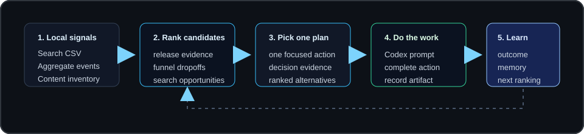

# Usage Guide

Everything the README summarizes, in full: installation, data files, configuration, every command, the recommended daily loop, and the decision rules behind the planner.

## Installation

For everyday use:

```bash
pip install git+https://github.com/R3ijar/open-growth-loop
```

For development, from a local checkout:

```bash
python -m venv .venv
. .venv/bin/activate          # Windows PowerShell: .\.venv\Scripts\Activate.ps1
python -m pip install -e .
python -m unittest discover -s tests
```

The CLI is available as `ogl` or `python -m open_growth_loop`.

## Workspace Layout

A workspace is any directory with a `data/` folder for inputs and an `outbox/` folder for generated reports. Every command takes `--workspace` (defaults to the current directory). Reports keep a stable `latest-*` path for daily use and also write a dated copy under `history/` so decisions can be compared over time.

Add `outbox/` to your `.gitignore` unless you want to version the generated reports.

## Data Files

The default files live under `data/`:

- `content_inventory.csv` — planned, staged, and published docs, guides, examples, and landing pages.
- `search_console_rows.csv` — queries, pages, impressions, clicks, CTR, and position.
- `events.csv` — first-party aggregate events: date, asset, event, count.
- `experiments.csv` — what was changed, when it shipped, and when it should be reviewed.
- `action_memory.csv` — what was completed and what happened later.

`ogl init` creates them with the expected headers. Bundled `.example.csv` files exist for demos; for real use, copy them without the `.example` suffix and fill in your data. Column-by-column schemas are documented in [SCHEMAS.md](SCHEMAS.md).

## Configuration

Optional settings live in `open-growth-loop.toml` at the workspace root.

If your exports use different column names, map them with schema aliases:

```toml
[schema_aliases.search_rows]
search_term = "query"
url = "page"
shown = "impressions"
rank = "position"

[schema_aliases.events]
day = "date"
path = "asset"
kind = "event"
total = "count"
```

Aliases only rename local CSV headers into the expected schema. They do not add credentials, call hosted APIs, or relax private-column validation.

Conservative defaults can be tuned in the same file:

```toml
[thresholds]
minimum_impressions = 25
minimum_views = 25
weak_cta_rate = 0.05
review_days = 14
stale_planned_days = 14
stale_shipped_days = 21
freshness_warn_days = 21
```

Command-line flags such as `--minimum-impressions`, `--minimum-views`, and `--weak-cta-rate` override the config for a single run. `weekly-review` uses `stale_planned_days` and `stale_shipped_days` to flag work waiting too long without artifact evidence. `freshness` and `plan` use `freshness_warn_days` to warn when real inputs are older than the trusted evidence window.

## Command Reference

Audit any repository with no data files:

```bash
ogl audit --workspace .                    # audit the workspace itself
ogl audit --repo path/to/other-repo       # audit another directory
ogl audit --summary report.md --strict    # append Markdown to a file; exit 1 on essential failures
```

Scaffold the audit's recommended action when it is mechanical:

```bash
ogl fix --workspace .                      # fix the recommended action
ogl fix --workspace . --check security_policy   # fix a specific check
ogl fix --workspace . --license mit --holder "Your Name"   # licenses require an explicit choice
ogl fix --workspace . --dry-run            # preview what would be written
ogl fix --workspace . --list               # show which checks have scaffolds
```

Scaffoldable checks: `license`, `readme` (only when missing), `changelog`, `contributing`, `code_of_conduct`, `security_policy`, `issue_templates`, `pr_template`, and `ci` (a starter workflow detected from `pyproject.toml`/`setup.py`, `package.json`, `Cargo.toml`, or `go.mod`). Generated files carry TODO markers and existing files are never overwritten. Checks that need project knowledge (`install`, `quickstart`, `docs`, `examples`, `release_tags`, or an existing thin README) return a Codex-ready prompt in the JSON output instead.

Create a maintainer brief from the audit and local Git state:

```bash
ogl steward --workspace .
ogl steward --workspace reports --repo path/to/other-repository
ogl steward --workspace . --no-write       # print JSON without creating outbox reports
```

The brief writes Markdown and JSON under `outbox/steward/`. It chooses one action from local evidence, records the decision boundary, and includes an agent handoff. It does not fetch remote issues, pull requests, CI logs, releases, or adoption metrics; inspect those separately before acting when they could change the priority.

Initialize and validate a workspace:

```bash
ogl init --workspace .
ogl validate --workspace .
```

Generate the main report set in one run:

```bash
ogl demo --workspace .
```

Check whether real local inputs are fresh enough to trust:

```bash
ogl freshness --workspace .
```

Run the planner and inspect its reasoning:

```bash
ogl plan --workspace .
ogl candidates --workspace .
ogl query-backlog --workspace .
```

Import aggregate events (privacy-safe columns only):

```bash
ogl import-events --source path/to/aggregate-events.csv --output data/events.csv
```

Track, complete, ship, and measure the selected action:

```bash
ogl track-experiment --workspace .
ogl complete --workspace .
ogl ship --workspace . --asset /docs/setup --artifact https://example.org/docs/setup
ogl outcome --workspace . --asset /docs/setup --outcome directionally_positive --confidence medium
ogl review-experiments --workspace .
```

Summarize, scan, and hand off:

```bash
ogl weekly-review --workspace .
ogl privacy-scan --workspace .
ogl prompt --workspace .
ogl issue-drafts --workspace .
ogl release-brief --workspace .
ogl report-index --workspace .
ogl doctor --workspace .
```

## The Daily Loop



Recommended maintainer workflow:

```bash
ogl import-events --source path/to/aggregate-events.csv --output data/events.csv
ogl freshness --workspace .
ogl plan --workspace .
ogl issue-drafts --workspace .
ogl track-experiment --workspace .
# ...ship one focused change...
ogl complete --workspace .
ogl ship --workspace . --asset /docs/setup --artifact https://example.org/docs/setup
ogl outcome --workspace . --asset /docs/setup --outcome directionally_positive
```

Give `outbox/prompts/latest-prompt.md` to Codex or another coding assistant and work on one concrete change before recording the public artifact with `ogl ship`. For a full walkthrough using the bundled sample CSVs, see [EXAMPLE_WORKFLOW.md](EXAMPLE_WORKFLOW.md).

## Decision Rules

The planner prioritizes:

1. Staged work that needs public release evidence.
2. Completed actions that still need an outcome recorded.
3. Funnel dropoffs with enough aggregate views.
4. Search opportunities with impressions and near-ranking positions.
5. Planned content/docs assets from the inventory.
6. Waiting for more data.

These rules are deliberately conservative. The tool should reduce thrash, not create a content treadmill.

Action memory gently adjusts candidate scores. Completed actions without outcomes are cooled down until they are reviewed. Exact asset/action repeats are cooled after measurement, while action types with directionally positive outcomes get a small boost for similar future work. Repeated weak outcomes get a small cooldown. This is local ranking context, not a causal impact claim.

Generated plans include a **Decision Trace** block recording the selected winner, ranked alternatives, why each alternative lost, thresholds used, blocked follow-ups, and memory adjustments — auditable before handing work to Codex or opening an issue. They also include a **Data Freshness** block: sample `.example.csv` files are marked as sample data, real CSVs are checked by latest date or file modification time, and stale data is a warning rather than a failure.

## What It Does Not Do

- It does not upload analytics, search data, or project files to a hosted service.
- It does not accept raw user, session, customer, email, IP, token, or secret fields — the event importer takes only `date,asset,event,count` and rejects private-looking columns.
- It does not publish docs, open PRs, or modify your site automatically.
- It does not claim a change worked from tiny samples or missing artifacts.
- It does not require GitHub auth, Search Console API access, or third-party credentials.
